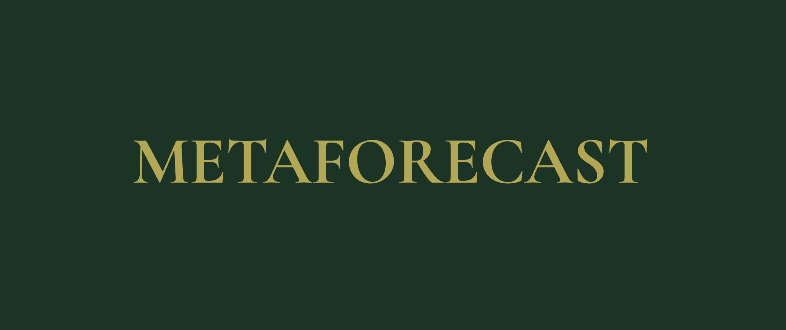

# metaforecast

<p align="center">
  
</p>

[](https://pypi.org/project/metaforecast/)
[](https://metaforecast.readthedocs.io/en/latest/?badge=latest)
[](https://github.com/vcerqueira/metaforecast)
[](https://pepy.tech/project/metaforecast)

metaforecast is a Python package for time series forecasting using meta-learning and data-centric techniques.

This package implements various techniques to improve forecasting accuracy
based on dynamic model combination, data augmentation, algorithm selection, and adaptive learning, building upon Nixtla’s awesome ecosystem of state-of-the-art forecasting methods.

## Features

metaforecast currently consists of five main modules:

1. **Dynamic Ensembles**: Combining multiple models with adaptive ensemble techniques, including online learning (exponential, polynomial, and related updates), sliding-window selection, and meta-learning-based weighting (ADE).
2. **Synthetic Time Series Generation**: Creating realistic synthetic time series data for robust model training and
   testing.
   Includes pure generators, semi-synthetic methods, transformation-based augmentation, and a callback for online data
   augmentation.
3. **Long-Horizon Meta-Learning**: Instance-based meta-learning for multi-step forecasting.
4. **Algorithm Configuration and Selection (COSEAL)**: Meta-learning methods for selecting forecasting algorithms and
   their configurations, including MetaARIMA and ActiveTesting.
5. **Evaluation**: Series-wise cross-validation splitters and aspect-based accuracy analysis with ModelRadar
   (horizon, groups, anomalies, hard series, and ROPE comparisons).

## Installation

You can install metaforecast using pip:

```bash
pip install metaforecast
```

### [Optional] Installation from source

To install metaforecast from source, clone the repository and run the following command:

```bash
git clone https://github.com/vcerqueira/metaforecast
cd metaforecast
pip install -e .
```

## Documentation

Check the [documentation](https://metaforecast.readthedocs.io/en/latest/index.html) for
the API reference and module descriptions.
You can get started with a few [tutorials](https://metaforecast.readthedocs.io/en/latest/notebooks.html).

----

### **⚠️ WARNING**

> metaforecast is in the early stages of development.
> The codebase may undergo significant changes.
> If you encounter any issues, please report
> them in [GitHub Issues](https://github.com/vcerqueira/metaforecast/issues)

## License

metaforecast is dual-licensed.

- **AGPL-3.0-or-later** for open-source use. You may use, modify, and share the
  source. If you distribute a modified version or run one in production, you
  must make the corresponding source available.

See [LICENSE](LICENSE) for the full terms.
